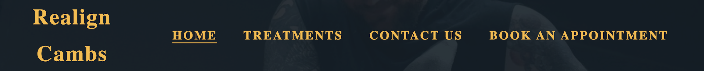
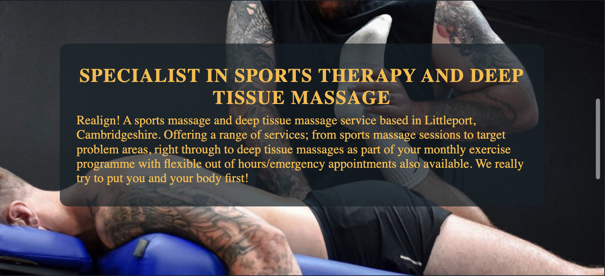
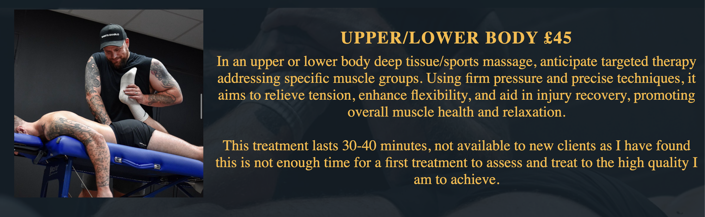

# Realign Cambs
## Site Introduction
Realign is a real business that specialises in deep tissue massage, sports massage, injury recovery and one on one coaching. The website had been made to showcase information about treatments that are offered and the positive impact they will have on your life. The users of the website will be able to find information about the company and the man behind the business, postitive benefits of having treatment, all of the treatments that are offered, where to find the company on social media and contact information with a booking page where there is an easy to navigate form to get booked in for the correct treatment.

## Ongoing Project
I would like to mention that I am challenging myself to keep this as an on-going project that will eventually be used as the official website for 'Realign' where clients can book appointments, get information on treatments and eventually have their own accounts with access granted to more indepth content and features.
## Table of contents
1. Site Introduction 
2. Ongoing Project
3. Planning Stage
   - Purpose of the site
   - Easy to navigate
   - Target audience
   - Colour Scheme
   - How will I achieve this?
4. Features/elements used on each page
   - Header element
      - Logo
      - Navigation Bar
   - Main element
   - Footer element
      - Social Media
      - Booking page button
5. Features/elements used on individual pages
   - index.html Home Page
     - Welcome
     - Reasons/Benefits
     - Contact Information/Social Media links
     - Location
       - Address
       - Google iFrame map
  - treatments.html Treatments Page
     - Treatments Title
     - Treatments list with prices
       - Information for what each treatment is
     - Treatments Footer
       - Click to book button (Linked to booking page)
  - booking.html Booking Page
    - Form Element
      - Input
        - text
        - email
        - tel
        - radio
        - checkbox
      - Select
        - Option
      - Textarea
      - Button
  6. Bugs and fixes

## Planning the website
### Site Purpose
 - To have clients understand the importance and benefits to getting treatment whilst trying not to overload them with information.
 - Allow users to enquire to book an appointment using the booking page and selecting the treatment they need.
 - Give a list of treatments available, with price and an explanation of whats inlcuded in the price.
 - Show images containing Gav, the man behind realign, to create a familiar face for new clients as they will have already seen him prior to their appointment.
### Easy to Navigate
 - I wanted to make my site easy to navigate to ensure that when people land on the site they are able to quickly see key information that naturaly leads you to booking an appointment.
 - Part of making the site easy to navigate came with the colour scheme I used, I opted for the colours that are very heavily used on the realign instagram and facebook pages, these colours when checked using a colour wheel/palette are a good match. This makes any navigation links easy to read and find your way around the page
### Target Audience
- The target audience for this website will be for people who; go to the gym, play sports, have an injury they need help with, have mobility problems, any general pain or muscle soreness and people who may want to get into better shape and maintain their body in general.
- People who go to the gym.
- People who play sports.
- People who have an injury they need help with recovery for.
- People who have problems with mobility or posture and want to correct this.
- People who have any general problem areas with pain or muscle soreness.
- People who want to get generally more active, in better shape and maintain their body to a higher standard via the one-to-one coaching service.
### How will I achieve all of this?
- Firstly the landing page has to be something that allows the user to instantly know where they are and what may be offered on this site. The home page for all screen sizes the site displays on will have a header with the logo 'Realign Cambs' with a welcome message below at the top of the main element with a short description of what realign specialises in and a little bit about the business.
- After landing on the Welcome message of the page learning the basic information of the service that may be offered I want to add a list of benefits to having treatment with realign, this will include things like general health benefits in day to day life aswell as benefits to those who like to push their bodies in the gym to cover all areas.
- By choosing the correct colours for the background and text I can achieve a sleek, easy to ready and navigate site. The darker blue background with the golden yellow text really pops and catches your eye onto key information.
- I want to add a fixed footer to the bottom of the screen housing the social media icons with href links to the respective pages, alongside the whatsapp link to open a chat to contact directly if you do not have either of the social medias.
#### Tools and Input from others
- Prior to deciding to undertake this project my mentor Alan suggested to included a parallax scroll effect using an image background. I really wanted to encorperate this into my page as it really allows the user to see what treatment may look like in the background whilst learning about the benefits of treatment and coming to realign for it.
- I got in touch with Gav, the owner of realign, prior to starting my project to see if it was an area he wanted to fill as he does not yet have a website. This is where not only my ideas came into the planning but Gavs did too, he wanted to have a simple and easy to use site so that existing clients or even potential new clients could select a treatment they wanted fill out the form with name, contact details and reason for booking then send the enquiry for him to then offer an appointment slot.
   - The reason he wanted the booking to be done this way is because he prides himself on making his treatments bespoke to every client, ie he does not want to accept a shorter appointment for a new client with no prior knowledge, by filling out the booking form this gives new clients a chance to give some information about their reason for booking and Gav can then contact and advise which treatment will be best suited.
   - I planned to consult Gav whilst making the website to ensure that things were looking and including the correct information as he imagined. This way the website will convey the image that he wants to bring across to any returning customer and potential new customers.
   - I wanted to write code for different ways parts of the page can be displayed and send screenshots to him so that he can decide which one best displays his image. Below will be an example of one of the many options he had to chose from, the choice he made is now the final look:
   
    
    
    
    

- Tools and extensions I plan to use to achieve my goal:
  - HTML and CSS validators, although being taught to use this at the end of the process I wanted to use this tool often throughout the process to check my code and make sure that there was not any invalid code that is inevitably redundent, this will also check for spelling errors in CSS.
- Chatgpt was used to generate the text which replaced the random placeholder text which cosists of the explanations of the benefits to treatment and the information on each treatment.
- I used and image file converter to change the images displayed on the website from .png files to .webp as this increased my google lighthouse score and allowed the images to load clearer.
- I used W3 Schools to learn how to add the code for the parallax effect and how to add links and images into readme.md files.
- Favicon to add the favicon next to the title of the page when you are on it.
- Font-awesome for the icons used.

## Features/Elements used on every page

### Header
- The same header was used on every page which I made resposive. On mobile devices this would display with the logo and a font-awesome icon of 2 horizontal lines to give a sleek simple look without crowding the space, when pressed the icon drops down into a navbar menu which showcases 4 links: Home, Contact Us, Treatments, Book and appointment, when clicked/pressed this takes you to the respective page or area of the page if you click contact us. No matter what page you are on you can always easily get to where you need to be as the navbar stayed fixed at the top of the page. 

- The image below shows how the navbar looks on all screen sizes larger than 768px. It displays this way on every page and also underlines the active page so that the user can easily tell which page they are on.

### Main Element
- This element has been used to house the majority of each pages content, the focal point of each respective page. Any information that is relevant to the page and any images that need showcasing.
- Each page showcases a background image with the parallax scrolling effect targetting the body element of each page. This allows the user to see an image of a customer undergoing treatment by realign (Gav), I have done this to try and create a sense of familiarity and if a new customer decides to book they know who to look for.

### Footer
- The footer element has been used on every page with all of them housing the social media icons with links to each respective social media page. The icons are responsive and invert colours when hovered over on laptops and desktop. Each link opens in a new tab, the footer is also fixed to the bottom of the page on each page.
  

## Features/Elements of each individual page

### index.html - Home Page

#### Welcome Section
- The welcome section contains a h2 element which explains to the user what the site is offering/specialises in, the p element below contains a short paragraph of text which explains where Realign is based, services offered and letting people know that their body should be no.1! I wanted to keep this short and sweet so people have a little bit about what, where and why, then want to read on for more.

#### Reasons/Benefits

- H2 element with 'Why should you get treatment with us? to entice the user to read through and answer that question.
- The reasons/benefits section is what the user will scroll down to see next which consists of 6 seperate benefits to having treatment each containing a h3 element with the benefit and a p element containing a short description of the benefit. This was purposefully placed below the welcome section as it explains generically what a potential customer will expect to get and feel after recieving treatment whilst not overloading with information. There is also a circle image used with changes position dependent on screen size, on sizes 768px+ and 992px+ the text is aligned half to the left and half to the right. On screen sizes 1200px+ the image is centered with the text 3 benefits either side. I decided to do this as I really liked the idea when doing the love running project and decided to try and replicate this, however I have added my own look on screen sizes of 992px+. This gave a sleek easy to read design, I consulted with Gav to check that he was happy with the text that Chatgpt wrote to fill these reasons and that he was happy with how it displayed on each screen size.

#### Contact Us

- The contact section displays a background image to break up the page from the parallax image, it has an element that is centered to the page which showcases the social media links, these links open in a new page. Although each social media icon is in the footer element on each page this ensures that users do not miss the contact links and whatsapp phone number.

#### Location/Address

- This section inlcudes the google iFrame map showcasing the general area to find realign. This is an interactive map and a link can be clicked to open directions into users map to easily arrive at the destination.
- This section also includes the address incase the google iFrame is not working or people would rather input the address into a map manually and helps with locating exactly where once you arrive.
- This section has been made responsive using flex-box.
  - Originally I had a lot of trouble making this section fully responsive on all screen sizes using flex-box, however afer some thought and playing around on flex froggy game I figured out that the problem lied with the class I was targeting in my CSS. Once I realised this I was able to achieve the fully responsive effect I wanted.

On mobile the address and map stack ontop of one another and take up 100% of the screen width, this was done to make it easier to read and look sleeker on a narrower screen.

### treatments.html - Treatments Page

#### Treatments title

- This section is the part of the treatments page that the user will first see when they land on the page. I wanted the title to be take up 100% of the screen and be displayed in larger bold text so catch the eye of the user and make it clear what to expect on this page.

#### Treatments List

- This section contains information on 6 different treaments that are offered, inlcuding price, time that the treatment takes, information on what to expect during the treatment and finally an image alongside.
- For smaller screens the text and image show in columns so that as you read you see the image for each treatment below. I will stress that every image is not directly linked to each treatment but some show before and afters of the treatment and some show general session being done, these are all real images supplied by realign themselves.
- For the larger screen sizes 992px and above I have used flex-box to display each treatment text beside the respective image. I have also made the text and image alternate each side to give a better look and user expereience when reading through.
- I have also used HR elements to break up each treatment to make it clear what text is relevant to each treatment

#### Treatment Footer

- I have added an extra element onto the footer on the treatments page which is a button to direct users to the booking page as they will naturally scroll down through the treatments then potentially book, even if they do not plan on booking there is a big button prompting them to click to book so they may click and end up enquiring.
- I have added a HR element with a margin to seperate the two footer elements.
- When the button is hovered over on larger screens the colours invert to make it clear that it is a button to be clicked. I have also added some finger pointing icons from font-awesome to prompt a mobile/tablet user to press the button with their finger.

 

### booking.html - Booking Page

#### Booking form 
- I have created the booking form baring in mind there may be new customers and returning customers using the booking system, for this reason some of the parts of the form are not 'required'. I also discussed how Gav wanted this to work as he does not currenlty have a calender setup with times and dates for people to book as he likes to speak with people before they have treatment to ensure they are booking in for the correct treatment and time slot. The current form is designed to 'enquire' prior to getting a set in stone date for an appointment. The idea I had was the form to be filled and automatically open a whatsapp chat with Gav and have the completed form details displayed, then a response from realign will  be offering a time slot which the customer will accept or reject.
- I have added a simple format to the booking form so that the user can fill out each part and read on below to complete and submit the form. It consists of First Name, Last Name, Email, Phone number, age and gender, which treatment (not required as someone may want to enquire as to what treatment they need), textarea for describing an injury or reason for booking, a terms tickbox which is required to ensure the user understands the booking policy and finally a submit button which will send off the information to realign.
 - The reason a treatment or reason is not required is to allow people that know which treatment they want to book by selecting the treatment and not listing a problem, also for people who do not know what treatment is needed so they can fill out the text area with their problem. Especially for the treatments that have not got set prices.
- The deployed site only uses the code institute form dump link to ensure that the form works, linking the form up to the whatsapp chat or email chain with realigns details is something that I plan on fine tuning for my ongoing project.

 
  

